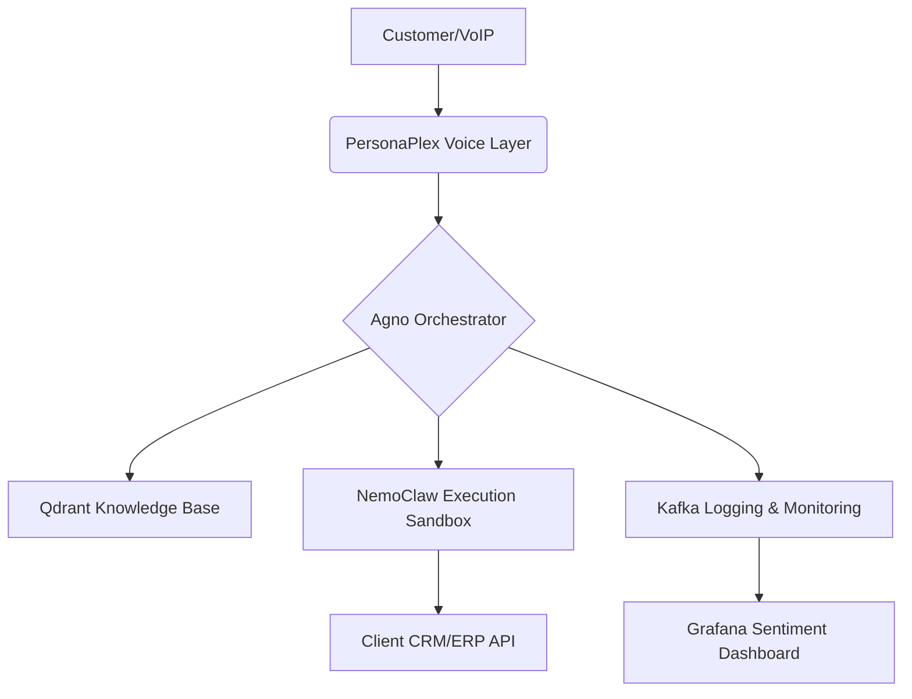

# AI-callcenter-Agent
Next-Gen AI BPO Platform powered by PersonaPlex, NemoClaw and OpenClaw
```markdown
# Aether AI: Next-Gen Autonomous AI BPO Platform 🚀

**Aether AI** is a high-performance, enterprise-grade AI Call Center solution designed to disrupt the traditional BPO industry. By leveraging cutting-edge Full-Duplex audio and secure execution environments, we provide an autonomous workforce that is indistinguishable from human agents.

## 🌟 Key Features

* **Real-Time Full-Duplex Voice:** Powered by **NVIDIA PersonaPlex**, enabling natural conversations with interruptions and backchanneling.
* **Secure Task Execution:** Integrated with **NemoClaw** to ensure all agent actions are sandboxed and compliant with enterprise security policies.
* **Multi-Tenant Architecture:** Built on **Kubernetes** to provide isolated environments (compute & data) for hundreds of clients simultaneously.
* **Context-Aware Intelligence:** Advanced **RAG (Retrieval-Augmented Generation)** using Qdrant and LlamaIndex for zero-hallucination support.
* **Scalable Messaging:** **Apache Kafka** backbone to handle thousands of concurrent calls with high throughput.

## 🏗 System Architecture



## 🛠 Tech Stack

| Layer | Technology |
| :--- | :--- |
| **Voice & Audio** | NVIDIA PersonaPlex, ElevenLabs, Twilio (SIP) |
| **Brain (LLM)** | Nemotron, Llama 3 (via Groq/Ollama) |
| **Orchestration** | Agno, LangGraph |
| **Execution** | NemoClaw, OpenClaw, MCP Tools |
| **Memory/RAG** | Qdrant, LlamaIndex, Redis |
| **Infrastructure** | Docker, Kubernetes, Apache Kafka |
| **Monitoring** | Grafana, Prometheus |

## 🚀 Getting Started

### Prerequisites
- Docker & Kubernetes
- NVIDIA GPU (Recommended for PersonaPlex)
- API Keys for Twilio & ElevenLabs

### Installation
1. Clone the repository:
   ```bash
   git clone [https://github.com/omarsalama12/AI-callcenter-Agent.git](https://github.com/omarsalama12/AI-callcenter-Agent.git)
   ```
2. Set up environment variables:
   ```bash
   cp .env.example .env
   ```
3. Deploy using Docker Compose:
   ```bash
   docker-compose up -d
   ```

## 📄 License
This project is licensed under the **MIT License**.

---
**Developed by Engineer Omar Salama (Aether AI)**

بمجرد ما تعمل **Commit** للملف ده، الـ Repo بتاعك هيتحول لـ Showcase احترافي لشركة **Aether AI**. 

إيه الخطوة الجاية؟ هل نبدأ نجهز ملف الـ `.env` عشان نحط فيه مفاتيح الـ API ونبدأ نربط أول "دماغ" للوكيل؟
